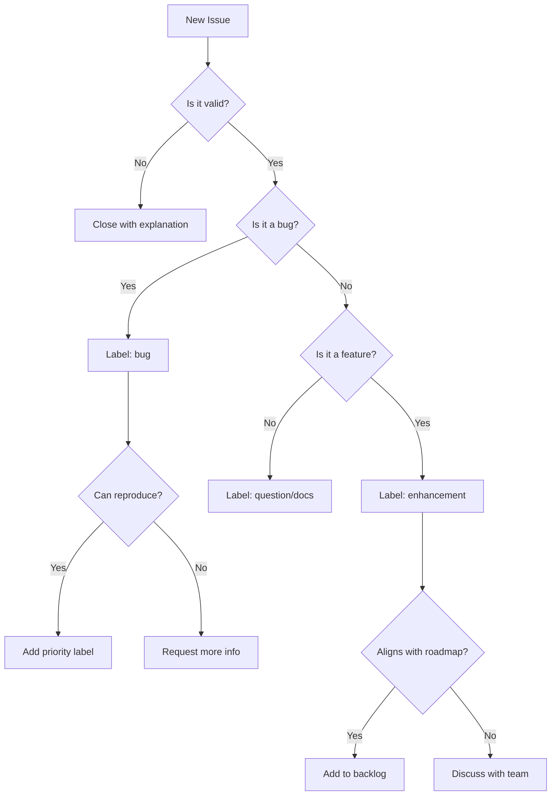

# Maintainer Handbook - AsyncAPI Conference Website

## Welcome, Maintainer

This handbook is your guide to maintaining the AsyncAPI Conference website. It covers everything from day-to-day responsibilities to emergency procedures.

## Maintainer Responsibilities

### Core Duties

**Code Review & Quality**

- Review and merge pull requests within 48 hours
- Ensure code meets quality standards
- Verify tests pass before merging
- Maintain consistent code style

**Issue Management**

- Triage new issues within 24 hours
- Label issues appropriately
- Close stale or resolved issues
- Create "good first issue" labels for newcomers

**Community Engagement**

- Respond to questions in Slack/GitHub
- Welcome new contributors
- Recognize contributions
- Foster inclusive environment

**Release Management**

- Coordinate releases
- Update changelog
- Deploy to production
- Monitor post-deployment

## Daily Workflow

### Morning Routine (15 minutes)

1. **Check GitHub Notifications**
   - Review new issues
   - Respond to PR comments
   - Check CI/CD status

2. **Triage New Issues**
   - Add labels
   - Assign to milestones
   - Request more information if needed

3. **Review PRs**
   - Quick scan of new PRs
   - Provide initial feedback

### Weekly Tasks

**Monday**

- Review open PRs
- Update project board
- Plan week's priorities

**Wednesday**

- Community check-in on Slack
- Review documentation updates
- Check dependency updates

**Friday**

- Prepare for releases if needed
- Update changelog
- Review metrics (analytics, performance)

## Issue Triage

### Labeling System

| Label | Description | Action |
|-------|-------------|--------|
| `bug` | Something isn't working | Needs investigation |
| `enhancement` | New feature request | Needs discussion |
| `good first issue` | Easy for newcomers | Provide guidance |
| `help wanted` | Extra attention needed | Seek contributors |
| `documentation` | Docs improvement | Usually quick fix |
| `duplicate` | Already reported | Close with reference |
| `wontfix` | Not planned | Close with explanation |
| `priority: high` | Urgent issue | Address ASAP |

### Triage Process



### Issue Templates

**Bug Report Response**

```markdown
Thanks for reporting this! I can confirm this is a bug.

**Steps to reproduce:**
1. [List steps]

**Expected behavior:** [Describe]
**Actual behavior:** [Describe]

I've labeled this as a bug and added it to our backlog. Would you like to work on a fix? I'm happy to provide guidance!
```

**Feature Request Response**

```markdown
Thanks for the suggestion! This is an interesting idea.

**Questions:**
- [Any clarifying questions]
- [Use cases to understand better]

I've labeled this as an enhancement. We'll discuss it in our next planning session and update you on the decision.
```

## Pull Request Review

### Review Checklist

**Code Quality**

- [ ] Follows existing code patterns
- [ ] Proper TypeScript types
- [ ] No console.log statements
- [ ] Meaningful variable names
- [ ] Comments for complex logic

**Functionality**

- [ ] Solves the stated problem
- [ ] No breaking changes (or documented)
- [ ] Edge cases handled
- [ ] Error handling implemented

**Testing**

- [ ] Tests pass locally
- [ ] CI/CD pipeline passes
- [ ] New tests added if needed
- [ ] Manual testing completed

**Documentation**

- [ ] README updated if needed
- [ ] Code comments added
- [ ] CHANGELOG updated
- [ ] Breaking changes documented

**Performance**

- [ ] No performance regressions
- [ ] Images optimized
- [ ] Bundle size acceptable
- [ ] Lighthouse score maintained

### Review Process

**1. Initial Review (5 minutes)**

```markdown
Thanks for the PR! I'll review this shortly.

Quick checklist:
- [ ] Does it solve the issue?
- [ ] Are there tests?
- [ ] Is the code clean?

I'll provide detailed feedback within 24 hours.
```

**2. Detailed Review (15-30 minutes)**

- Check out branch locally
- Test functionality
- Review code thoroughly
- Leave inline comments

**3. Approval or Request Changes**

**Approval Template:**

```markdown
Excellent work! This looks great. 

✅ Code quality
✅ Tests passing
✅ Documentation updated

Merging now. Thanks for your contribution! 🎉
```

**Request Changes Template:**

```markdown
Thanks for this PR! I've left some comments inline. Here's a summary:

**Required Changes:**
- [List critical issues]

**Suggestions (optional):**
- [List nice-to-haves]

Let me know if you have questions. Happy to help!
```

## Release Process

### Versioning

We follow [Semantic Versioning](https://semver.org/):

- **MAJOR** (X.0.0): Breaking changes
- **MINOR** (0.X.0): New features (backward compatible)
- **PATCH** (0.0.X): Bug fixes

### Release Checklist

**Pre-Release (1 day before)**

- [ ] All PRs for release merged
- [ ] Tests passing on main branch
- [ ] Changelog updated
- [ ] Version bumped in package.json
- [ ] Documentation updated

**Release Day**

- [ ] Create release branch: `release/vX.Y.Z`
- [ ] Final testing on release branch
- [ ] Create GitHub release with notes
- [ ] Tag release: `git tag vX.Y.Z`
- [ ] Deploy to production
- [ ] Monitor for issues

**Post-Release**

- [ ] Announce in Slack
- [ ] Tweet from @AsyncAPISpec
- [ ] Close milestone
- [ ] Update project board

### Release Notes Template

```markdown
# Release vX.Y.Z

## 🎉 New Features
- Feature 1 (#PR_NUMBER)
- Feature 2 (#PR_NUMBER)

## 🐛 Bug Fixes
- Fix 1 (#PR_NUMBER)
- Fix 2 (#PR_NUMBER)

## 📚 Documentation
- Doc update 1 (#PR_NUMBER)

## 🙏 Contributors
Thanks to @contributor1, @contributor2 for their contributions!

## 📦 Upgrade Guide
[If breaking changes, provide upgrade instructions]
```

## Deployment

### Production Deployment

**Netlify Automatic Deployment**

1. Merge to `main` branch
2. Netlify automatically builds and deploys
3. Monitor build logs
4. Verify deployment at production URL

**Manual Deployment (if needed)**

```bash
# Build locally
npm run build

# Test build
npm run start

# Deploy via Netlify CLI
netlify deploy --prod
```

### Rollback Procedure

**If deployment fails:**

1. Check Netlify build logs
2. Identify failing commit
3. Revert commit: `git revert <commit-hash>`
4. Push to main
5. Wait for auto-deployment

**Emergency rollback:**

1. Go to Netlify dashboard
2. Find previous successful deployment
3. Click "Publish deploy"
4. Investigate and fix issue

## Community Management

### Welcoming New Contributors

**First-Time Contributor Template:**

```markdown
Welcome to AsyncAPI! 🎉 Thanks for your first contribution!

A few things to help you:
- Check out our [Contributing Guide](CONTRIBUTING.md)
- Join our [Slack](https://asyncapi.com/slack-invite)
- Feel free to ask questions!

I'll review your PR shortly. Thanks again!
```

### Recognizing Contributions

**After Merge:**

```markdown
Merged! Thanks @contributor! 🎉

Your contribution will be in the next release. I've added you to our contributors list.

Looking forward to more contributions from you!
```

### Handling Conflicts

**Disagreement on Approach:**

1. Listen to all perspectives
2. Seek compromise
3. Escalate to team if needed
4. Document decision

**Code of Conduct Violations:**

1. Review Code of Conduct
2. Gather facts
3. Contact violator privately
4. Take appropriate action
5. Document incident

## Emergency Procedures

### Production Down

**Immediate Actions:**

1. Check Netlify status
2. Review recent deployments
3. Check error logs
4. Rollback if needed

**Communication:**

1. Post in #conference-website Slack channel
2. Update status page if available
3. Keep stakeholders informed

### Security Vulnerability

**If vulnerability reported:**

1. Acknowledge receipt within 24 hours
2. Assess severity
3. Create private security advisory
4. Develop and test fix
5. Deploy fix ASAP
6. Publish security advisory
7. Thank reporter

### Data Breach

**Immediate Actions:**

1. Isolate affected systems
2. Notify AsyncAPI leadership
3. Assess scope of breach
4. Preserve evidence
5. Follow incident response plan

## Monitoring & Metrics

### Key Metrics to Track

**Performance**

- Lighthouse scores (weekly)
- Core Web Vitals
- Bundle size
- Page load times

**Usage**

- Page views (Google Analytics)
- Conversion rates
- User flow
- Bounce rates

**Development**

- PR merge time
- Issue resolution time
- Contributor count
- Code coverage

### Tools

- **Netlify**: Deployment and hosting
- **Google Analytics**: User analytics
- **Lighthouse CI**: Performance monitoring
- **GitHub Insights**: Development metrics

## Knowledge Base

### Common Issues

**Issue: Build fails with "Module not found"**

```bash
# Solution
rm -rf node_modules package-lock.json
npm install
```

**Issue: Styles not updating**

```bash
# Solution
rm -rf .next
npm run dev
```

**Issue: Images not loading**

- Check file path is correct
- Verify image exists in `public/`
- Check Next.js Image component syntax

### Useful Commands

```bash
# Check for outdated dependencies
npm outdated

# Update dependencies
npm update

# Audit for vulnerabilities
npm audit

# Fix auto-fixable vulnerabilities
npm audit fix

# Check bundle size
npm run build
# Then check .next/analyze/client.html

# Run Lighthouse locally
npx lighthouse http://localhost:3000
```

## Handoff Checklist

### Onboarding New Maintainer

- [ ] Add to GitHub team with write access
- [ ] Add to Netlify team
- [ ] Add to Slack channels
- [ ] Share this handbook
- [ ] Pair on first PR review
- [ ] Pair on first release
- [ ] Introduce to community
- [ ] Schedule regular check-ins

### Offboarding Maintainer

- [ ] Remove GitHub access
- [ ] Remove Netlify access
- [ ] Update CODEOWNERS file
- [ ] Thank publicly for contributions
- [ ] Transfer ongoing responsibilities
- [ ] Archive maintainer notes

## Resources

### Documentation

- [Architecture Overview](architecture_overview.md)
- [Developer Guide](developer_onboarding_guide.md)
- [Contributing Guide](CONTRIBUTING.md)

### External Resources

- [Next.js Documentation](https://nextjs.org/docs)
- [React Documentation](https://react.dev)
- [Tailwind CSS](https://tailwindcss.com/docs)
- [AsyncAPI Slack](https://asyncapi.com/slack-invite)

### Contacts

**AsyncAPI Leadership**

- [List key contacts]

**Emergency Contacts**

- [List emergency contacts]

---

**Remember**: Being a maintainer is about enabling others to contribute. Focus on:

- Clear communication
- Timely responses
- Constructive feedback
- Community building

You've got this! 🚀
