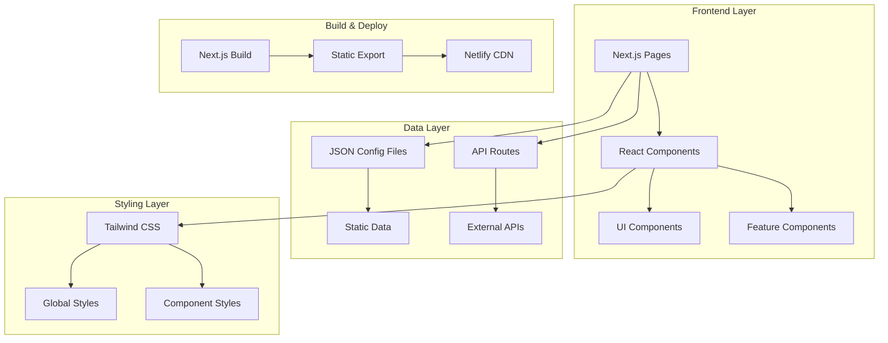
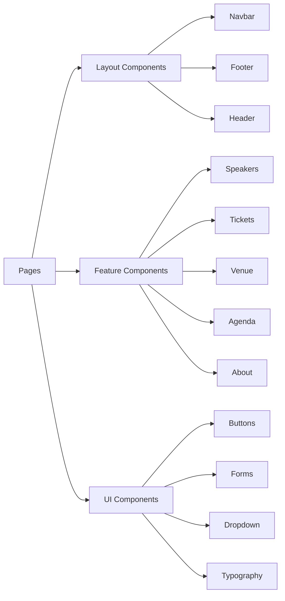
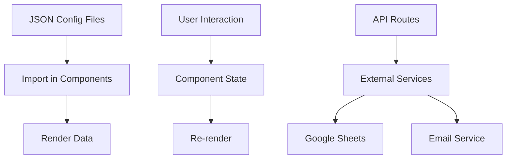
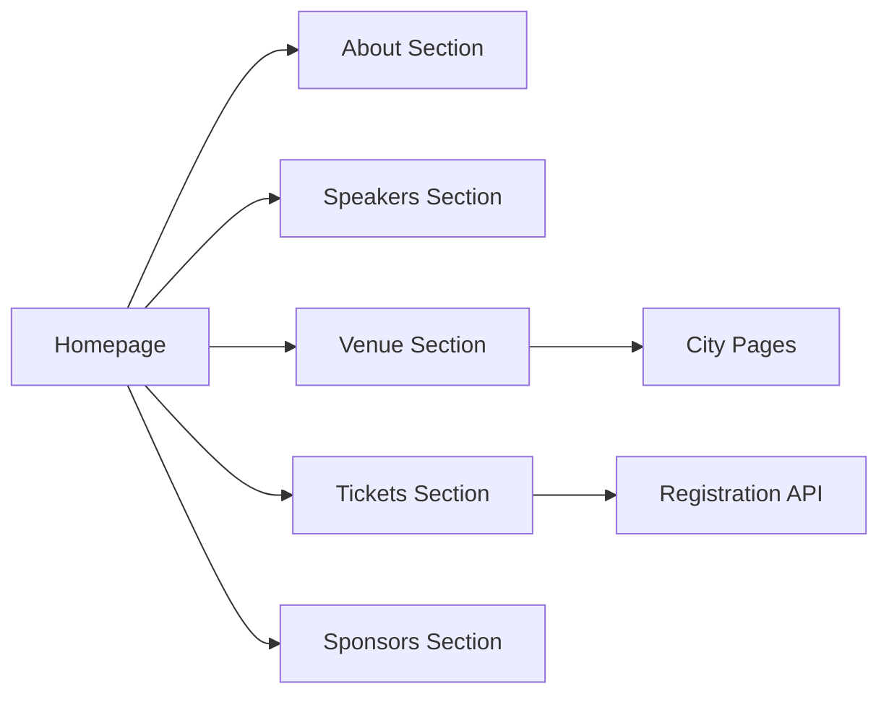
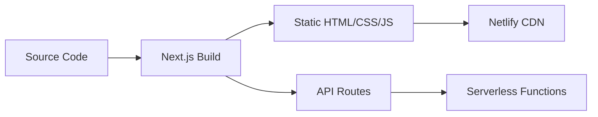

# AsyncAPI Conference Website - Architecture Overview

## System Overview

The AsyncAPI Conference website is a Next.js-based web application that serves as the central hub for conference information, registration, and community engagement.

### High-Level Architecture



## Component Hierarchy

### Component Organization



### Component Categories

**Layout Components** (`components/Navbar`, `components/Footer`, `components/Header`)

- Provide consistent page structure
- Handle navigation and branding
- Responsive behavior for mobile/desktop

**Feature Components** (`components/Speakers`, `components/Tickets`, etc.)

- Implement core conference features
- Manage feature-specific state
- Integrate with data layer

**UI Components** (`components/Buttons`, `components/Form`, etc.)

- Reusable interface elements
- Design system primitives
- Consistent styling and behavior

**Illustration Components** (`components/illustration/`)

- SVG icons and graphics
- Brand assets
- Decorative elements

## Data Flow

### Current Data Architecture



### Data Sources

**Static Configuration** (`config/`)

- `speakers.json` - Speaker information
- `tickets.json` - Ticket types and pricing
- `agenda.json` - Schedule and sessions
- `city-lists.json` - Venue locations
- `links.json` - Navigation structure
- `socials.ts` - Social media links

**External APIs**

- Google Sheets API for registration data
- Nodemailer for email notifications

## Tech Stack

### Core Technologies

| Technology | Version | Purpose |
|------------|---------|---------|
| Next.js | 15.5.9 | React framework, SSG/SSR |
| React | 18.2.1 | UI library |
| TypeScript | 5.8.3 | Type safety |
| Tailwind CSS | 3.0.24 | Styling framework |

### Key Dependencies

**UI & Interaction**

- `react-responsive` - Responsive design hooks
- `react-select` - Dropdown components
- `react-slick` - Carousel functionality
- `react-confetti` - Celebration effects
- `react-hot-toast` - Toast notifications

**Data & APIs**

- `axios` - HTTP client
- `@googleapis/sheets` - Google Sheets integration
- `nodemailer` - Email functionality

**Development Tools**

- `cypress` - E2E testing
- `storybook` - Component development
- `prettier` - Code formatting
- `eslint` - Code linting

## Design Patterns

### Component Patterns

**Container/Presentational Pattern**

```tsx
// Container Component (logic)
function SpeakersContainer() {
  const [speakers, setSpeakers] = useState(speakersData);
  const [filter, setFilter] = useState('all');
  
  const filteredSpeakers = useMemo(() => 
    speakers.filter(s => filter === 'all' || s.city.includes(filter)),
    [speakers, filter]
  );
  
  return <SpeakersList speakers={filteredSpeakers} onFilterChange={setFilter} />;
}

// Presentational Component (UI)
function SpeakersList({ speakers, onFilterChange }) {
  return (
    <div>
      {speakers.map(speaker => <SpeakerCard key={speaker.id} {...speaker} />)}
    </div>
  );
}
```

**Composition Pattern**

```tsx
// Flexible component composition
<Navbar>
  <NavLogo />
  <NavLinks links={navigationLinks} />
  <NavActions>
    <Button>Register</Button>
  </NavActions>
</Navbar>
```

### State Management

**Local Component State**

- Used for UI-specific state (dropdowns, modals, forms)
- React `useState` and `useReducer` hooks

**Shared State**

- Currently minimal - mostly prop drilling
- Future: Consider Context API or Zustand for complex state

### Styling Approach

**Utility-First CSS (Tailwind)**

```tsx
<div className="flex items-center justify-between p-5 bg-gradient-to-r from-blue-500 to-purple-500">
  <h1 className="text-2xl font-bold text-white">AsyncAPI Conference</h1>
</div>
```

**Custom CSS for Complex Animations**

```css
/* globals.css */
@keyframes fadeIn {
  from { opacity: 0; transform: translateY(20px); }
  to { opacity: 1; transform: translateY(0); }
}

.animate-fade-in {
  animation: fadeIn 0.6s ease-out;
}
```

## Routing Structure

### Page Routes

```
/                    → Homepage (index.tsx)
/past-editions       → Past conferences
/[city]              → City-specific pages (dynamic)
/api/register        → Registration endpoint
/api/subscribe       → Newsletter subscription
```

### Navigation Flow



## Build & Deployment

### Build Process



### Deployment Pipeline

1. **Development**: `npm run dev` - Local development server
2. **Build**: `npm run build` - Production build
3. **Export**: `npm run export` - Static site generation
4. **Deploy**: Netlify automatic deployment from `main` branch

### Environment Configuration

```bash
# example.env.local
GOOGLE_SHEETS_CLIENT_EMAIL=
GOOGLE_SHEETS_PRIVATE_KEY=
GOOGLE_SHEET_ID=
EMAIL_USER=
EMAIL_PASS=
```

## Performance Considerations

### Optimization Strategies

**Image Optimization**

- Next.js `Image` component for automatic optimization
- WebP format for speaker images
- Lazy loading for below-fold images

**Code Splitting**

- Automatic route-based code splitting
- Dynamic imports for heavy components
- Tree shaking for unused code

**Static Generation**

- Pre-render pages at build time
- Fast page loads from CDN
- No server-side rendering overhead

## Accessibility

### Current Implementation

- Semantic HTML structure
- ARIA labels on interactive elements
- Keyboard navigation support
- Focus management in modals/dropdowns

### Areas for Improvement

- Comprehensive screen reader testing
- Color contrast validation
- Skip navigation links
- ARIA live regions for dynamic content

## Security Considerations

### Current Measures

- Environment variables for sensitive data
- HTTPS enforcement via Netlify
- Input validation on forms
- Rate limiting on API routes (to be implemented)

### Recommendations

- Add CSRF protection
- Implement rate limiting
- Add input sanitization
- Regular dependency audits

## Future Architecture Considerations

### Scalability

**Content Management**

- Migrate from JSON to headless CMS (Contentful/Sanity)
- Enable non-technical content updates
- Version control for content

**State Management**

- Introduce Context API for shared state
- Consider Zustand for complex state logic
- Implement proper data fetching patterns

**Testing**

- Add unit tests (Jest + RTL)
- Expand E2E test coverage
- Implement visual regression testing

### Monitoring & Analytics

**Performance Monitoring**

- Lighthouse CI integration
- Core Web Vitals tracking
- Bundle size monitoring

**User Analytics**

- Google Analytics integration (react-ga)
- Event tracking for key interactions
- Conversion funnel analysis
